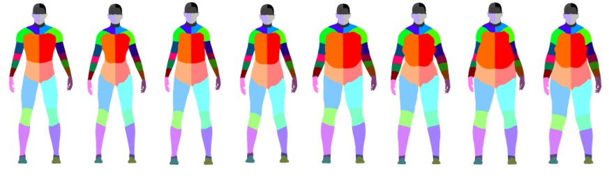
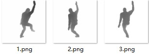
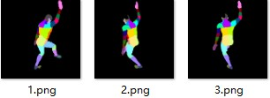
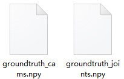
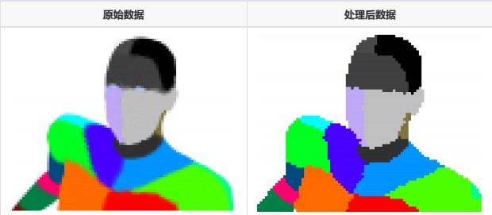
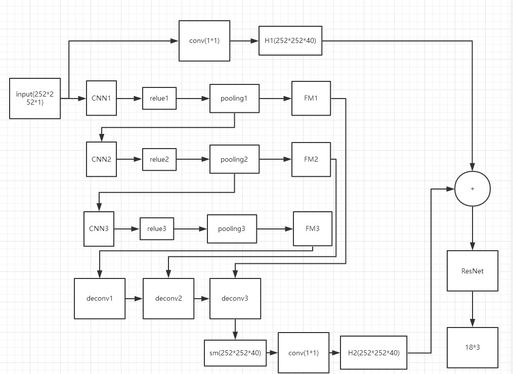

#### Tools
- PYthon（pytorch）
- C++
- ubuntu16.04（deep learning）
- windows（TOFSDK）

---
#### KAT-MOCAP
KAT-MOCAP 是基于TOF技术开发的全身动作捕捉系统，启动于2018年4月份，历时大约3个月，其基于德州仪器的
OPT8241 [TOF开发板](http://www.ti.com.cn/product/cn/opt8241/description/)，关于TOF
的工作原理，我在这不再赘述，详细的资料大家可以自行查询。整个开发周期较短，工作进度较赶，若在开发类似项目时，希望在时间评估上再做一些细节优化。
    

---


#### TOF的优劣势
Tof因为是主动式的光捕系统，因此在抗干扰能力上较好。同期较为成熟的产品有Microsoft 的Kinect2，其实现的方案为RGB—D，除了深度信息外，还有RGB颜色
信息，Microsoft虽然提供了实现论文，但是同期并未有类似产品诞生，在细节上应该并未完全开源。现在机器学习领域中，RGB识别较为成熟，开源的项目也远多
于TOF技术。除此之外，TOF的训练数据集远小于RGB的数据集.2018年秋天，Microsoft将推出Kinect4，且应该只对开发者开放，是否会产生合作模式，尚且不知。
    

---

## ==深度学习部分==
#### UBC3V Dataset

[数据简介](https://github.com/ashafaei/ubc3v/)  这是我们使用的数据集。

 == 此数据集因是在Maya软件中渲染的，因此没有噪声，属于理想数据，但是在实际使用过程中Tof Camera肯定会产生一定的噪声，因此需要考虑到这点。==
      
        
此数据主要有3个部分：Ease_pose，Inter_pose，hard_pose
在数据训练时，我们首先使用Ease_pose对权重进行预训练，然后将Inter_pose，hard_pose放在一起对权重进行训练。后期一个batch时间大概为7小时，在1070 GPU下。
    

---

#### 数据预处理
在数据预处理部分主要用于后面的feed net，在处理的时候，需要让相机在世界坐标系与相机坐标系之间转换.同时每一个动作，
都会有3*深度图 + 3*分割图 + 骨骼关节点位置 + 分割图信息   





    
        
        
    因为Maya软件自带的抗锯齿功能使得UBC3V有一定的抗齿距，如下图：


我们的做法：首先将整幅图像理解为“歧义”与“精确”两部分。其中“精确”的意思是我明确认为这个像素所拥有的颜色为已经预设的颜色。“歧义”的意思与之相反，即不
我预设的颜色值，所以我们将“歧义”部分删去，并将“精确”部分膨胀，直至填满歧义部分。在保证TOF数据准确的情况下，我们参考了其他论文的方案，在深度图中放
置一个bounding volume。这样做的原因是，训练时，实际关节点我们是已知的，因此，可以以Hip位置为中心，来将人物框出来，然后对深度图进行归一化，使得所有
的图像都差不多大小，关于框的信息，我们都使用Josn文件保存在CPP-config文件夹下。
    

---

###### 数据增强
比较重要的一点：因为TOF在拍摄时，因为硬件原因，会产生一定的噪声，因此，在训练数据的时候，我们考虑了两个方案：
一、使用Gan网络。二、在UBC3V数据的基础上加上一定的背景噪声。在考虑开发周期中，最后我们选择了方案二。
首先我们在体验间录了一些背景数据，并将数据保存下来，在数据预处理的时候将这些背景数据随机加载到UBC3V上，这样可以使整个网络结构具有一定的抗干扰的能力。
    

---

####     模型
我们是在Ubantu下进行的开发，使用的主要工具是FaceBoo维护的Pytorch。首先，我们使用的是开源项目Pytorch-fcn与UBC3V论文进行结合，自主开发了一个
FCN模型，用于分割人体不同位置，但是实验结果表明。训练出来的模型，只能在UBC3V这个模型上有良好的表现，在TOF实际数据下表现不理想。当时考虑到的原因：真实
数据中的噪声影响太大。于是，我们在上述的模型下又加了一个分支，此分支直接回归出人体的18个关节点。在使用后，发现，关节点的位置也不能很好的回归，考虑到
的原因：FCN中的加法操作（反响传播）影响到了前面的卷积层。在数据上：我们使用过一个开源项目Cyclegan，来对数据进行处理，但是得到的数据不是很好，所以途中
放弃，但是这个思路一定是有价值的，有机会我会继续研究下去。后期我们使用Resnet网络来直接回归18个关节点，这样处理后的模型在真实数据上有较好的表现，能很
好的预估出人体的姿势，因此我们将此作为我们的baseline，目的是在此基础上做出更好的模型。最后我们总结了所有的经验，将网络和成为下图样式：


在结合的基础上，我们将每条分支都加上了一个1*1的conv层，此做法来源与[论文](https://arxiv.org/abs/1603.06937/).在实现细节上讲的很透彻，大家可以拜读一下。

---

#### 开发中的启发
我们在实际开发中，因为一次疏忽，忘记对segmation进行归一化处理。此时图中的H1部分可以说是已经整段垮掉了，但是，实际训练出来的权重在识别上却并未有较大的
差异。因此可以说明，此模型中，ResNet的权重更加偏向于深度图（H2），而（H1）部分所占的比重较少，但这并不意味着（H1）不重要。关于ResNet大家可以去看看何凯明的论文，在当时还是相当优秀的。
    

---

####    今后可以优化的方向
1.数据集上，我们需要一个真实的数据集，即是真人拍摄，可以是human3.6 或者 自己采集的数据集。
2.可以利用ICP注册，来实时捕捉人体的位置。自动生成bounding box。
    

---

## ==硬件部分==
Tof的硬件部分主要考虑的是数据的准确性与噪声
####     准确性
刚拿到TOF相机时，在实际测距时，发现其给出的参数与实际参数有较大的差距。随后我们发现时镜头光学畸变引起的，因此需要对Tof进行一系列的校准，我做了一些整理，具体的大家可以看官方给出的手册
 
```
Lens Calibration（镜头校准）  必须
      镜头校准的目的是克服镜头带来的光学畸变。在没有任何光学畸变的情况下，每个像素都可以被转换成等效的世界坐标。
      镜头校准的目标是将失真的像素坐标转换成可在针孔照相机模型下使用的等效坐标。
	  这个过程提取了一组通常被称为特征的参数包括9个值，
	  [k1, k2 k3]这些参数是径向畸变系数，
	  [p1,p2]是切向畸变
	  [Cx,Cy]是图像中心的坐标
	  [fx,fy]是x和y的焦距
	  这个过程需要一个棋盘图案的几个振幅图像.棋盘格的角被提取为通过最小二乘最小化来计算其特性的数据点.
	 执行过程中需要考虑到以下几个条件：
	   1.整个棋盘图中尽可能多地填充屏幕
	   2.需要从多角度去拍摄
	   3.在捕捉过程中保持棋盘格的模式
	   
	 过程：
	    1.需要一张A2的黑白的棋盘纸
		2.双击ADD，尽量让棋盘纸 充满整个摄像机
		3.需要至少拍摄8张
		4.成功捕捉黑白棋盘纸时，会有颜色补充。
	   
	   
Frequency Calibration(频率校准)
     频率校准确定了补偿频率寄存器设置所必需的比例因子，以便产生所需的频率。在没有频率校准的情况下，假设一个比例因子为1。
	

	
Crosstalk Calibration(串扰矫正)
     串扰矫正克服了由于像素串扰而相位测量的变化。
	 1.要执行串扰校正，在距离上放置一个小反射器，这样反射器就会变成图像中的单个像素
	 2.点击校准来对图像进行采样以提取过滤器内核函数

	 
	 
	 
Nonlinearity Calibration（非线性矫正）
     为了达到最佳的精确度，必须考虑到原始相位测量和实际深度之间存在的相对较小的非线性关系。


关于Voxel Viewer的一些看法
  1.此软件属于官方软件，但是性能很差，随时会奔溃
  2.在配置部分，打开后会显示开发板上存储的配置与PC端有的配置，可以互相拷贝。配置文件之间会存在继承关系，即没有设置到的文件会向上查询直到查询到。
  3.此软件会在一些特殊情况下自动修改默认配置文件，需要注意，检查的方式：关闭软件后再次打开，查看右侧参数是否是需要的参数。
                                                                                                                                                                            
                                                                                                                           
```
#### 噪声
关于噪声而言，我们会在时域上先使用VoxelSDK自带的一个时域滤波先进行第一步的滤波，滤出的效果并不理想。随后，根据两帧之间的差值，与附近像素
灰度值，将闪点去除。在实际对于图像处理过程中，应该对症下药，实际情况实际分析。同时在深度学习部分，我们加入了一定的噪声背景，因此在实际滤
波过程中不必对噪声过于苛刻。因为从Tof的原理上出发，它接受到的是红外光，室内照明还好，但是接收到自然光时，就会产生一定干扰，因此在训练模型时，加入一定的噪声，可以增加整个模型的鲁棒性。
